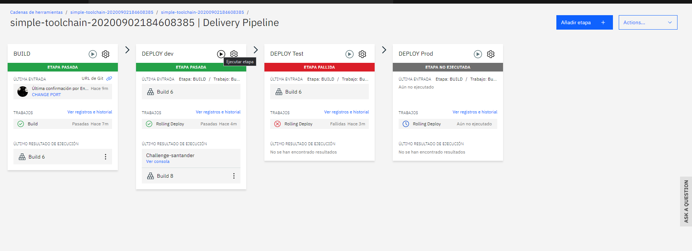

# Challenge Santander

API usada para el clima: https://community-open-weather-map.p.rapidapi.com
El clima es de Buenos Aires, capital .

Usuarios admin para acceder a la aplicación con un usuario válido guardado en la base de datos que por el momento lo crea un administrador.
usuario de prueba:
usuario: eiz
contraseña: 1234

# Stack de la aplicación

ReactJS (hooks) + Express + Cloudant (DB NoSQL)

# CI/CD and deployment process

La app está desplegada en CloudFondry IBM cloud . Se está usando el servicio toolchain para un ci/cd
En cuanto se hace un 'push' en git se genera un build y este pasa a dev y test, un librarian podría entrar y pasar a prod apretando el botoncito de play arriba en el apartado de deploy prod.

En el futuro se podría definir pasos intermedios con unit testing y testeos automáticos.

# URL del test:
challenge-santander.mybluemix.net